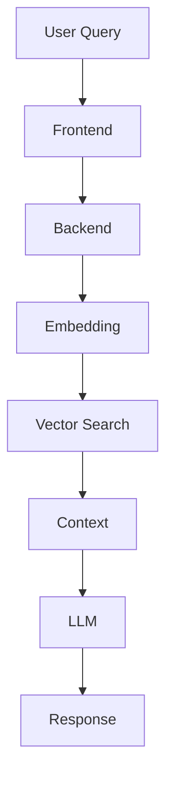

---
# 🎓 Avichi College Admission Chatbot: Project Report

This report documents the design, implementation, and future scope of the AI-powered admission assistant for Avichi College of Arts and Science.

---

## 📄 Page 1: Abstract

### Executive Summary
The **Avichi College Admission Chatbot** is a sophisticated digital assistant engineered to revolutionize the student recruitment and inquiry process. By leveraging modern **Retrieval-Augmented Generation (RAG)** technology, the system provides a 24/7 intelligent help desk capable of delivering instantaneous, contextually accurate responses.

### Key Impact
- **Resolution of Information Barriers**: Eliminates wait times  
- **Scalability**: Handles thousands of queries  
- **Resource Optimization**: Reduces admin workload  

---

## 📄 Page 2: Introduction

### Digital Transformation in Higher Education
Traditional admission systems face major bottlenecks. This chatbot bridges the communication gap.

### Problem Statement
- Bottlenecks due to limited working hours  
- Inconsistent responses  
- High manual workload  

### Objectives
1. 24/7 support  
2. Accurate responses using RAG  
3. Accessible from anywhere  

---

## 📄 Page 3: Scope

### Target Departments
- BCA  
- BBA  
- B.Com  

### Functional Scope
- Eligibility checking  
- Fee details  
- Campus info  
- Application guidance  

---

## 📄 Page 4: Existing System

| Feature | Manual System | Impact |
|--------|-------------|--------|
| Availability | Business Hours | No support at night |
| Response Time | 5–15 mins | Delay |
| Travel | Required | Costly |
| Redundancy | High | Staff fatigue |

---

## 📄 Page 5: Proposed System

### Advantages
- ⚡ Instant response  
- 💡 Smart suggestions  
- 🔒 Accurate (RAG-based)  
- 💰 Cost efficient  

---

## 📄 Page 6: System Configuration

### Tech Stack (MERN)
- Frontend: React.js  
- Backend: Node.js + Express  
- Database: MongoDB Atlas  
- AI: OpenRouter (Gemini / Claude)  

---

## 📄 Page 7: Database

```javascript
const VectorContentSchema = new mongoose.Schema({
  text: String,
  type: String,
  embedding: [Number],
  metadata: Object
});
```

---

## 📄 Page 8: Data Flow



---

## 📄 Page 9: Core Code

```javascript
async function answerQuery(userQuery, history) {
  const embedding = await generateEmbedding(userQuery);

  const results = await VectorContent.aggregate([
    {
      $vectorSearch: {
        index: "vector_index",
        path: "embedding",
        queryVector: embedding,
        limit: 5
      }
    }
  ]);

  const context = results.map(r => r.text).join("\n");
  return await callAI(userQuery, context, history);
}
```

---

## 📄 Page 10: UI Design
- Chat-style interface  
- Glassmorphism UI  
- Mobile responsive  

---

## 📄 Page 11: Future Enhancements
- Multilingual (Tamil)  
- Voice input  
- WhatsApp integration  
- Form auto-fill  

---

## 📄 Page 12: Conclusion
- Fast  
- Accurate  
- User-friendly  

---

## 📄 Page 13: Bibliography
- MongoDB Docs  
- React Docs  
- OpenRouter API  
:::

---

## 💡 Pro Tip (Important)
If you want **slides style inside GitHub**, you can:
- Use **GitHub Pages + Reveal.js**
- Or create a **separate PPT**

---

## 🚀 Final Fix Summary
👉 Remove ` ```carousel `  
👉 Keep normal Markdown  
👉 Then GitHub will render perfectly  

---

If you want next upgrade 🔥  
I can make:
- ⭐ **Top-level GitHub README (with badges, demo link, screenshots)**  
- 🎯 **Viva-ready explanation (what to say line-by-line)**  
- 📊 **PPT slides version (clean & professional)**
