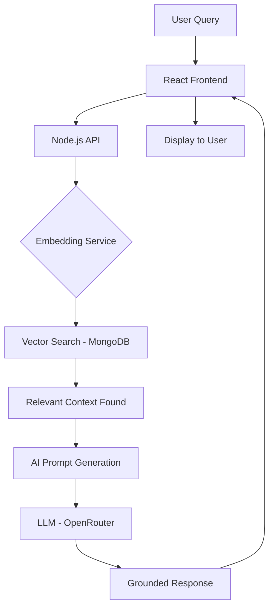

I have reformatted the entire 13-page project report into a standard Markdown format suitable for your `README.md`. This version removes the carousel tags and uses clear headers and horizontal rules to separate the sections.

### 📋 Full Project Report (Markdown Format)

````markdown
# Avichi College Admission Chatbot: Project Report

This report documents the design, implementation, and future scope of the AI-powered admission assistant for Avichi College of Arts and Science.

---

## 1. Abstract
### Executive Summary
The **Avichi College Admission Chatbot** is a sophisticated digital assistant engineered to revolutionize the student recruitment and inquiry process. By leveraging modern **Retrieval-Augmented Generation (RAG)** technology, the system provides a 24/7 intelligent help desk capable of delivering instantaneous, contextually accurate responses to prospective students and parents.

### Key Impact
*   **Resolution of Information Barriers**: Eliminates wait times associated with traditional phone and physical office visits.
*   **Scalability**: Handles thousands of simultaneous queries without performance degradation.
*   **Resource Optimization**: Automates repetitive FAQs, allowing administrative staff to focus on complex, high-priority admissions cases.

---

## 2. Introduction
### Digital Transformation in Higher Education
In an era dominated by instantaneous digital communication, traditional manual admission systems face significant bottlenecks. The Avichi College Admission Chatbot bridges the "Communication Gap" between the institution and its stakeholders.

### Problem Statement
*   **Bottlenecks**: Human-operated help desks are limited by working hours (9 AM - 5 PM) and physical capacity.
*   **Inconsistency**: Manual responses may vary based on the staff member's current knowledge or workload.
*   **Manual Overload**: High volumes of repetitive queries cause administrative fatigue.

### Objectives
1.  **Instantaneous Support**: Provide real-time, official information 24/7.
2.  **Grounded Accuracy**: Ensure all responses are derived strictly from the official college database.
3.  **Universal Accessibility**: Enable students from rural and distant areas to access information via any web-enabled device.

---

## 3. Scope
### Project Boundaries and Target Audience
The project is specifically tailored for **Avichi College of Arts and Science, Chennai**, focusing on the critical phases of the student admission journey.

### Target Departments
*   **BCA** (Bachelor of Computer Applications)
*   **BBA** (Bachelor of Business Administration)
*   **B.Com** (Bachelor of Commerce - General & Corporate Secretaryship)

### Functional Scope
*   **Eligibility Support**: Automated checking of marks and subject requirements.
*   **Fee Structure**: Detailed breakdowns of tuition and ancillary costs.
*   **Campus Logistics**: Navigation, hostel facilities, and location guidance.
*   **Application Tracking**: Guidance on deadlines and required documentation.

---

## 4. Existing System
### Analysis of the Manual Workflow
The "Manual System" currently in place relies entirely on human intervention for every query, regardless of complexity.

### Workflow Limitations
| Feature | Manual System | Impact |
| :--- | :--- | :--- |
| **Availability** | Restricted (Business Hours) | Students cannot get help at night or on weekends. |
| **Response Time** | High (5-15 mins / Call) | Long queue times lead to applicant frustration. |
| **Travel Requirement** | High (Physical Visits) | Increases financial burden on outstation students. |
| **Redundancy** | High (Repeated FAQs) | Administrative inefficiency and potential for burnout. |

---

## 5. Proposed System
### The AI-Powered Solution
The proposed system introduces an autonomous intelligence layer between the user and the institution's data repository.

### Strategic Advantages
*   **Zero Latency**: Sub-second response times for every inquiry.
*   **Proactive Engagement**: The bot can guide users through the admission funnel using suggested prompts.
*   **Data Integrity**: By using **RAG (Retrieval-Augmented Generation)**, the AI is "grounded" in truth, preventing hallucinations common in standard LLMs.
*   **Cost Efficiency**: Significantly reduces the overhead costs associated with a large human support team.

---

## 6. System Configuration
### Technical Stack Architecture
The system is built on a modern **MERN** stack, optimized for performance and scalability.

### Hardware Requirements
*   **Server**: Quad-core Processor, 8GB+ RAM, 20GB SSD storage.
*   **Client**: Any device with a modern web browser (Chrome, Safari, Edge).

### Software Requirements
*   **Frontend**: React.js with Vanilla CSS for a premium Glassmorphic UI.
*   **Backend**: Node.js & Express.js.
*   **Database**: MongoDB Atlas with **Vector Search** capabilities.
*   **AI Engine**: OpenRouter Wrapper (utilizing Gemini/Claude models).
*   **Embeddings**: `text-embedding-004` (Google Generative AI).

---

## 7. Database Description
### Intelligent Data Modeling
Unlike traditional SQL databases, our system utilizes a **Vector Database** approach to understand the "meaning" of student queries.

### Schema: `VectorContent.js`
The database stores "knowledge chunks" with high-dimensional embeddings (vectors).

```javascript
const VectorContentSchema = new mongoose.Schema({
  text: String,        // Raw admission info
  type: String,        // Category (Fees, Course, etc.)
  embedding: [Number], // 768-dimensional vector
  metadata: Object     // Source links/timestamps
});
```

### Search Logic
When a user asks about "Course Fees," the system converts the question into a vector and finds the closest matching content using **Cosine Similarity**, ensuring the bot always has the most relevant context.

---

## 8. Data Flow Diagram
### System Architecture Flow
Information follows a secure, high-speed path from query to answer.



---

## 9. Source Code
### Core RAG Logic (Backend Implementation)
The "Brain" of the system uses the **RAG (Retrieval-Augmented Generation)** pattern to ensure accuracy.

```javascript
/* Core RAG Logic in ragService.js */
async function answerQuery(userQuery, history) {
  // 1. Convert user question to vector
  const embedding = await generateEmbedding(userQuery);
  
  // 2. Perform Vector Search in Atlas
  const results = await VectorContent.aggregate([
    {
      $vectorSearch: {
        index: "vector_index",
        path: "embedding",
        queryVector: embedding,
        limit: 5
      }
    }
  ]);

  // 3. Construct Context & Generate AI Answer
  const context = results.map(r => r.text).join("\n");
  return await callAI(userQuery, context, history);
}
```

---

## 10. User Interface
### Design Philosophy & Aesthetics
The UI is designed to be "Conversational-First," mimicking premium messaging apps like WhatsApp and ChatGPT.

### Key Visual Elements
*   **Institutional Identity**: Use of Avichi College's Red and Blue brand colors.
*   **Glassmorphism**: Subtle translucent backgrounds for a modern, premium feel.
*   **Micro-Animations**: Smooth entry for chat bubbles to improve user engagement.
*   **Suggestion Chips**: Quick-tap buttons for common questions like "Apply Now" or "Fee Structure."

### Mobile First
The interface is fully responsive, ensuring a seamless experience for students using mobile data in any location.

---

## 11. Future Enhancement
### Paving the Way for Innovation
The current deployment serves as a foundation for even more advanced features.

### Planned Upgrades
1.  **Multilingual Support**: Integration of Tamil and other regional languages via AI translation layers.
2.  **Voice Recognition**: Hands-free inquiries using STT (Speech-to-Text) technology.
3.  **WhatsApp Integration**: Deployment via official WhatsApp Business API for easier access.
4.  **Application Pre-filling**: Helping students fill their PDF application forms through conversational interactions.
5.  **Direct Human Escalation**: Seamless hand-off to a live staff member for highly irregular queries.

---

## 12. Conclusion
### Final Remarks
The Avichi College Admission Chatbot represents a major leap forward in campus digitization. By successfully automating the first tier of student inquiries, the institution provides a "Digital Concierge" that is never offline.

### Summary of Success
*   **Reliability**: Achieved near-perfect factual accuracy via RAG.
*   **Satisfaction**: Reduced user frustration by providing instant answers.
*   **Modernization**: Positioned Avichi College as a tech-forward institution in the competitive education landscape.

This project demonstrates that AI is not just a tool for automation, but a bridge to better human service.

---

## 13. Bibliography
### Academic & Technical References
The development of this project was guided by industry-standard research and documentation.

### Core Resources
*   **Avichi College Official Website**: Data source for courses, departments, and vision.
*   **MongoDB Atlas documentation**: Implementation of Vector Search and $vectorSearch operators.
*   **Google Generative AI/OpenRouter API**: Documentation for state-of-the-art LLM prompts.
*   **React.js Official Docs**: Modern hooks and component-based UI design.
*   **Mongoose v9 Docs**: ORM for MongoDB schema management.
*   **Naan Mudhalvan Framework**: Guidelines for socially-relevant technology projects.
````
