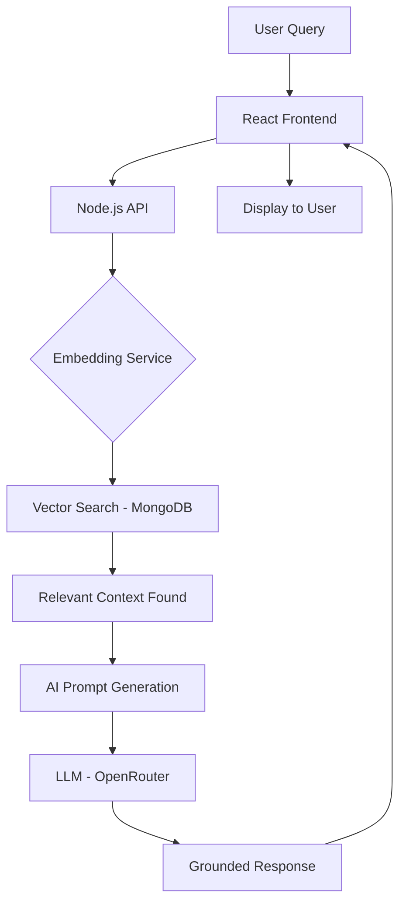

# 🎓 Avichi College Admission Chatbot

An AI-powered admission assistant for **Avichi College of Arts and Science**, built using Retrieval-Augmented Generation (RAG) to provide instant, accurate, and 24/7 support to prospective students.

---

## 📌 Abstract

The Avichi College Admission Chatbot is a sophisticated digital assistant engineered to revolutionize the student recruitment and inquiry process. By leveraging modern **RAG (Retrieval-Augmented Generation)** technology, the system provides a 24/7 intelligent help desk capable of delivering instantaneous, contextually accurate responses to prospective students and parents.

---

## 🎯 Objectives

- **Instantaneous Support** — Provide real-time, official information 24/7.
- **Grounded Accuracy** — Ensure all responses are derived strictly from the official college database.
- **Universal Accessibility** — Enable students from rural and distant areas to access information via any web-enabled device.

---

## 🏫 Scope

**Target College:** Avichi College of Arts and Science, Chennai

**Target Departments:**
- BCA (Bachelor of Computer Applications)
- BBA (Bachelor of Business Administration)
- B.Com (Bachelor of Commerce — General & Corporate Secretaryship)

**Functional Coverage:**
- Eligibility Support — Automated checking of marks and subject requirements
- Fee Structure — Detailed breakdowns of tuition and ancillary costs
- Campus Logistics — Navigation, hostel facilities, and location guidance
- Application Tracking — Guidance on deadlines and required documentation

---

## ⚙️ Tech Stack

| Layer | Technology |
|---|---|
| **Frontend** | React.js with Vanilla CSS (Glassmorphic UI) |
| **Backend** | Node.js & Express.js |
| **Database** | MongoDB Atlas with Vector Search |
| **AI Engine** | OpenRouter Wrapper (Gemini / Claude models) |
| **Embeddings** | `text-embedding-004` (Google Generative AI) |

**Hardware Requirements:**
- Server: Quad-core Processor, 8GB+ RAM, 20GB SSD
- Client: Any device with a modern web browser (Chrome, Safari, Edge)

---

## 🗄️ Database Schema

The system uses a **Vector Database** approach to understand the meaning of student queries.

```javascript
// VectorContent.js
const VectorContentSchema = new mongoose.Schema({
  text: String,        // Raw admission info
  type: String,        // Category (Fees, Course, etc.)
  embedding: [Number], // 768-dimensional vector
  metadata: Object     // Source links/timestamps
});
```

When a user asks a question, it is converted into a vector and matched to the closest content using **Cosine Similarity**.

---

## 🔄 Data Flow



---

## 🧠 Core RAG Logic

```javascript
// ragService.js
async function answerQuery(userQuery, history) {
  // 1. Convert user question to vector
  const embedding = await generateEmbedding(userQuery);

  // 2. Perform Vector Search in Atlas
  const results = await VectorContent.aggregate([
    {
      $vectorSearch: {
        index: "vector_index",
        path: "embedding",
        queryVector: embedding,
        limit: 5
      }
    }
  ]);

  // 3. Construct Context & Generate AI Answer
  const context = results.map(r => r.text).join("\n");
  return await callAI(userQuery, context, history);
}
```

---

## 🎨 UI Design

- **Brand Colors** — Avichi College's Red and Blue identity
- **Glassmorphism** — Subtle translucent backgrounds for a modern feel
- **Micro-Animations** — Smooth chat bubble entry for better engagement
- **Suggestion Chips** — Quick-tap buttons for common queries (e.g., "Apply Now", "Fee Structure")
- **Mobile First** — Fully responsive for students using mobile data from any location

---

## 🚀 Future Enhancements

1. **Multilingual Support** — Tamil and regional languages via AI translation layers
2. **Voice Recognition** — Hands-free inquiries using STT (Speech-to-Text)
3. **WhatsApp Integration** — Deployment via WhatsApp Business API
4. **Application Pre-filling** — Conversational assistance for filling PDF application forms
5. **Live Agent Handoff** — Seamless escalation to a human staff member for complex queries

---

## ✅ Conclusion

The Avichi College Admission Chatbot represents a major leap forward in campus digitization. By automating the first tier of student inquiries, it acts as a **Digital Concierge** that is never offline — achieving near-perfect factual accuracy via RAG, reducing user frustration with instant answers, and positioning Avichi College as a tech-forward institution.

> *This project demonstrates that AI is not just a tool for automation, but a bridge to better human service.*

---

## 📚 References

- [Avichi College Official Website](https://avichicollege.edu.in) — Data source for courses, departments, and vision
- [MongoDB Atlas Documentation](https://www.mongodb.com/docs/atlas/) — Vector Search and `$vectorSearch` operators
- [Google Generative AI / OpenRouter API](https://openrouter.ai/docs) — LLM prompt documentation
- [React.js Official Docs](https://react.dev) — Modern hooks and component-based UI
- [Mongoose v9 Docs](https://mongoosejs.com/docs/) — ORM for MongoDB schema management
- **Naan Mudhalvan Framework** — Guidelines for socially-relevant technology projects
