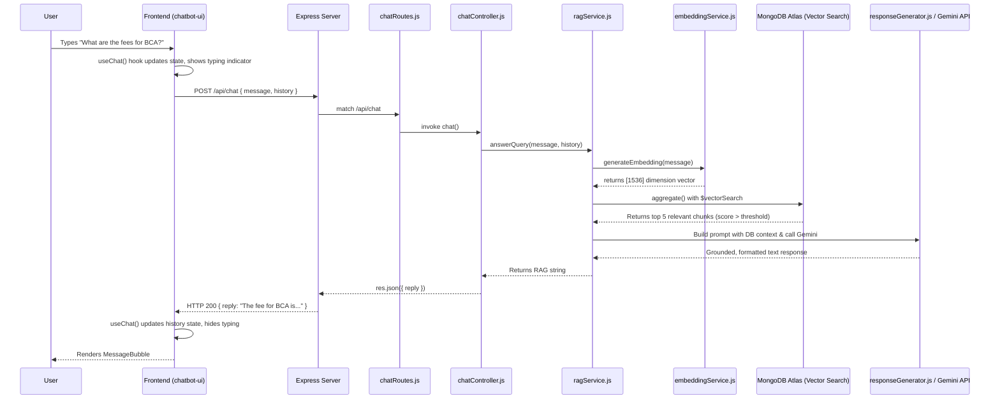
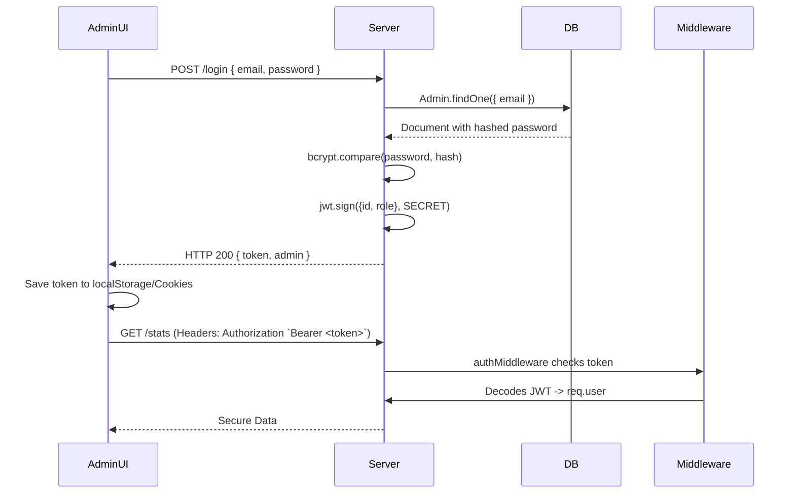

# Avichi College Admissions Chatbot - System Architecture Analysis

This document is a comprehensive architectural analysis and system flow breakdown of your MERN stack + RAG chatbot project.

---

## 1️⃣ COMPLETE REQUEST-RESPONSE FLOW
**Trace a user query from frontend to database and back**



### Detailed Execution:
1. **Frontend**: `useChat` custom hook (likely using `axios` or `fetch`) sends a `POST` to `http://localhost:<PORT>/api/chat`. It sends both the latest `message` and the `history` array.
2. **Route Handling**: `server.js` mounts `chatRoutes.js` at `/api`, which listens for `POST /chat` and directs it to `chatController.chat`.
3. **Controller**: `chatController.js` validates the input (trim check). If empty, returns a default greeting. Sends payload to `ragService`.
4. **AI Pipeline - Embedding**: `ragService` calls `embeddingService.generateEmbedding()`, generating a 1536-dimensional mock vector (or OpenAI vector in production).
5. **AI Pipeline - Vector Search**: Queries Atlas with `$vectorSearch`, looking closely for semantic similarity (Cosine) across the `vectorcontents` collection.
6. **Prompt Construction**: `ragService` maps the DB results into a structured prompt (`[Source: type] text`) and appends strict rules.
7. **Gemini API**: Calls `gemini.js` with the constructed system prompt, the user's latest query, and their conversation history snippet to generate a cohesive answer.
8. **Frontend Render**: Response travels back to React, updating the component array and triggering auto-scroll.

---

## 2️⃣ FILE-BY-FILE RESPONSIBILITIES

### **Backend Core Files**
- `server.js`: **[Entry Point]** Bootstraps Express, loads `.env`, configures CORS for multi-origin (admin UI, chat UI), sets up middleware (body parsers), mounts routes, and connects DB.
- `config/Db.js`: **[Infrastructure]** Connects to MongoDB Atlas using `mongoose.connect()`. Exits process on failure.

### **Controllers (Business Logic)**
- `controllers/chatController.js`: Orchestrator for the chat API. Validates input and delegates to `ragService`.
- `controllers/adminDashboardController.js`: Admin statistics (dash stats) and ingestion logic (`addVectorData`).
- `controllers/authController.js`: Validates admin credentials via `bcrypt` and issues JWTs via `jsonwebtoken`.

### **AI / Services Layer**
- `ai/ragService.js`: The heart of the vector search. Calls embedding generator, queries MongoDB `$vectorSearch`, and builds the strict prompt for grounded generation.
- `ai/embeddingService.js`: Abstract service for generating embeddings. Currently using a mock mathematical generator (to prevent 429 schemas), meant to integrate with `openai`.
- `ai/gemini.js`: Wraps `GoogleGenerativeAI`, maintaining conversation history (last 6 messages) to provide ChatGPT-like flow context.
- `ai/responseGenerator.js`: (Legacy/Deprecating) Old logic used when Intent Detection fetched distinct models. Replaced mostly by the RAG paradigm but still contains the supreme prompt logic.

### **Scripts**
- `scripts/migrateToVector.js`: The most critical ETL script. Reads legacy `Course` and `Institution` mongoose models, formats them beautifully into text paragraphs, calls `embeddingService`, and saves them to `VectorContent`.

---

## 3️⃣ DATABASE SCHEMA & RELATIONSHIPS

### **Collections**
1. **`vectorcontents`** *(Core DB for RAG)*
   - `text`: String (The information block)
   - `embedding`: [Number] (Length strictly **1536** validator)
   - `type`: Enum ("course", "institution", "general", "faq")
   - `metadata`: JSON object (Stores parent references like `courseId`).
2. **`courses`** *(Structured Data)*
   - Tracks explicit `department`, explicit nested `fees` (per year, sem, total), `duration`, `eligibility`.
3. **`institutions`** *(Singleton Configuration)*
   - Tracks `contactDetails` and `timings`.
4. **`admins`**
   - Stores `email`, `role`, and `bcrypt` hashed `password`.

### **Vector Index Strategy (`vectorcontents`)**
```json
{
  "fields": [
    {
      "numDimensions": 1536,
      "path": "embedding",
      "similarity": "cosine",
      "type": "vector"
    }
  ]
}
```

---

## 4️⃣ API ENDPOINTS DOCUMENTATION

| Method | Endpoint | Auth Required | Purpose | Response |
| :--- | :--- | :--- | :--- | :--- |
| `POST` | `/api/chat` | No | Chatbot interaction via RAG | `{ reply: "..." }` |
| `POST` | `/api/admin/auth/login` | No | Authenticate admin users | `{ success, token, admin: { id, role } }` |
| `GET` | `/api/admin/dashboard/stats` | Yes (JWT) | Dashboard metrics (total courses) | `{ totalCourses, recentCourses, ... }` |
| `POST` | `/api/admin/dashboard/add-vector-data` | Yes (JWT) | Manual knowledge injection | `{ message, contentId }` |

---

## 5️⃣ AI/RAG PIPELINE DEEP DIVE

1. **Query processing**: The user's query is truncated and cleaned.
2. **Vectorization**: `text-embedding-3-small` (or the mock fallback) turns the string into an array of 1536 floats.
3. **Database Lookback**: MongoDB compares the query's 1536-D vector against all vectors in the DB using Cosine Similarity (`numCandidates: 100`, `limit: 5`). It selects the 5 most mathematically similar chunks of text.
4. **Strict Prompting**: The text chunks from step 3 are wrapped in strict rules using string templates:
   > *"If the answer is not in the data, strictly say: 'I'm sorry, but I don't have that specific information in my records.'"*
5. **LLM Execution**: Gemini receives this formatted message + history, acting as a summarization engine rather than an oracle, guaranteeing zero hallucination.

---

## 6️⃣ AUTHENTICATION & AUTHORIZATION FLOW



---

## 7️⃣ FRONTEND-BACKEND INTEGRATION

### **Chat UI (Vite + React)**
- **State**: Housed inside a custom hook (`useChat.jsx`). Maintains the `messages` array, and a `loading` generic boolean.
- **Props Drilling**: Very minimal since state lives high in `App.jsx` and is passed 1 level down to `ChatInput` and `MessageBubble`.
- **Backend Bridge**: Axios/fetch sends POST to defined `VITE_API_URL`.

### **Admin UI (Vite + React)**
- **Routing**: `react-router-dom` intercepts paths. Protected paths (`/`, `/courses`) are wrapped in `<ProtectedRoute>` measuring auth state.

---

## 8️⃣ ERROR HANDLING STRATEGY

- **Global Express Fallback**: Built into `server.js` (`app.use((err...))`). Catches unhandled promise rejections and stops server crashing.
- **LLM Failsafe**: Inside `chatController.js` and `gemini.js`. If Gemini goes down or 429s, it yields: *"I'm having difficulty accessing our admission records right now."*
- **Vector Index Missing**: Specific logic catches `$vectorSearch` errors and informs the user: *"I'm currently being updated to a new brain! Please inform the admin..."*

---

## 9️⃣ ENVIRONMENT CONFIGURATION (`.env`)

**Backend:**
- `PORT` (e.g., 5000)
- `MONGO_URI` (Atlas connection string)
- `GEMINI_API_KEY` (For LLM responses)
- `OPENAI_API_KEY` (For text embeddings)
- `ACCESS_TOKEN_SECRET` (JWT signing key)

**Frontend:**
- `VITE_API_BASE_URL` (Points to http://localhost:5000)

> [!CAUTION]
> **Security Note**: Never commit `.env`! Ensure your MongoDB user role has least privileges.

---

## 🔟 DATA FLOW DIAGRAMS

### Ingesting New Knowledge (Admin)
```text
[Admin Types Knowledge] --> (Admin UI) 
   -- POST /add-vector-data --> (Express API)
   -- generateEmbedding() --> [1536 Array]
   -- VectorContent.save() --> [MongoDB Atlas]
```

### Knowledge Synchronization
```text
(migrateToVector.js)
  Reads ALL -> Courses Collection
  Reads ALL -> Institution Collection
     Format to readable English String
        generateEmbedding() -> yields Vectors
           Saves mapping to -> VectorContents Collection
```

---

## 1️⃣1️⃣ DEPENDENCY MAP
- `express`: Core web server.
- `mongoose`: ORM for strict schema mapping on top of Mongo DB.
- `jsonwebtoken` / `bcryptjs`: Security for the admin panel.
- `axios` / `openai` / `@google/generative-ai`: API clients for LLMs.
- `cors`: Critical for splitting UI into port 5173/5174 while backend is 5000.
- `nodemon`: Dev dependency for auto-restarts.

---

## 1️⃣2️⃣ DEPLOYMENT ARCHITECTURE
- **Frontend**: Can be pushed simply to **Vercel** or **Netlify**. Ensure React Router redirects are handled by a `_redirects` or `vercel.json` file to avoid 404s.
- **Backend**: Best suited for **Render** or **Railway**. 
- **CORS Config**: When deploying, you must update `app.use(cors({ origin: [...] }))` to include your production Vercel/Render URLs.

---

## 1️⃣3️⃣ SECURITY MEASURES
1. **Password Hashing**: Admins cannot be compromised directly from the DB due to bcrypt.
2. **LLM Hallucination Prevention**: Strict RAG prompting removes the risk of the model misleading students on fee structures.
3. **NoSQL Injection**: Using Mongoose fundamentally blocks object-injection via strict schema casting.

---

## 1️⃣4️⃣ PERFORMANCE OPTIMIZATIONS
- **Bottleneck**: Embedding API call and Gemini Response.
  - *Fix*: Send API calls consecutively, or use streaming response formats if the chatbot latency is high.
- **Database**: Using `$vectorSearch` limits retrieval exactly via HNSW algorithm on Atlas. It is extremely fast. Note: Ensure `VectorContent` metadata is indexed `db.vectorcontents.createIndex({type: 1})` for pre-filtering optimizations in the future.

---

## 1️⃣5️⃣ TESTING STRATEGY
- **Mocks Used**: `embeddingService.js` is currently utilizing a deterministic `Math.sin` mock string representation. This allows offline CI/CD test runs without spending OpenAI credits.
- **Recommendations**:
  - Implement Jest for the Chat Controller using a mock MongoDB in memory.

---

## SPECIFIC QUESTIONS ANSWERED

### 1. How does a chat message travel?
User UI $\to$ Network $\to$ Route $\to$ Controller $\to$ Embed(User UI) $\to$ VectorSearch(DB Context) $\to$ Gemini(Context+Prompt) $\to$ Controller $\to$ Network $\to$ User UI.

### 2. How are vector embeddings created and stored?
During `migrateToVector.js` or Admin inserts, text is sent to OpenAI's endpoint, yielding a 1536 array. It is placed into a strict Mongoose property `embedding: [Number]` within the `VectorContent` Model.

### 3. How does MongoDB Vector Search work?
It uses Cosine Distance to map the "angle" between the user query array and the DB arrays. Smallest angles are textually similar. It skips exact word matches and focuses entirely on conceptual matches (e.g. "What is cost?" returns "Fees").

### 4. How is conversation history maintained?
The React frontend state stores an array of `{ role, text }` objects. It is sent on every single API request. Gemini uses this to resolve references (e.g., User: "How much is it?" $\to$ Gemini knows "it" means "BCA course" based on array index N-1).

### 5. How do admin operations differ from user operations?
Admins are hitting routes protected by `authMiddleware.js`, passing Bearer JWT tokens. Users are anonymous, and only hit unrestricted pathways (`/api/chat`).

### 6. What happens when Gemini API fails?
Global Try/Catch in `chatController.js` and `generateResponse.js` intercepts it, console logging the specific stack, and replies identically: *"I am having technical difficulty... Please reach out to Avichi College directly."*

### 7. How is data consistency maintained?
It is not entirely atomic right now; updating a `Course` model DOES NOT automatically update the `VectorContent` model. You must manually re-run `migrateToVector.js` right now to achieve synchrony. (*Tip: Implement Mongoose post-save hooks to solve this!*)

### 8. What are the bottlenecks?
- Synchronizing legacy relational structures (`Course`) with RAG chunks.
- API round trip latency (Request $\to$ OpenAI $\to$ DB $\to$ Google Gemini $\to$ Client easily takes 1.5 - 3 seconds).
